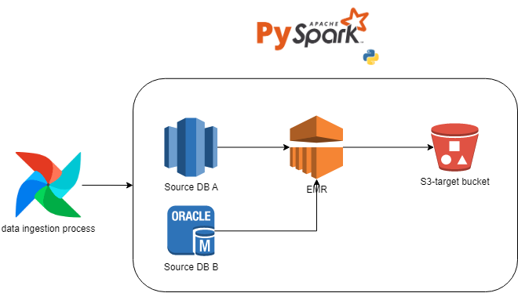

# Ecommerce API (Data Extraction and Transformation)
## Description

This Python project makes use of two APIs to retrieve data, specifically:

- European Central Bank's Statistical Data Warehouse API to obtain exchange rates
- A fake eCommerce API to retrieve products data
The program filters and retrieves all the products from the "Shoes" category, and creates a new pandas dataframe that includes the following information:

    - all products
    - price in USD
    - price in EUR
    - date of the exchange rate used

## Project Structure

Copy code
```
.
├── bin
│   └── methods.py
├── .env
├── .gitignore
├── main.py
├── Makefile
├── README.md
└── requirements.txt
```

- bin/methods.py: Contains the implementation of the methods required to execute the project.
- .env: Contains environment variables required to run the program.
- .gitignore: Contains files and folders to ignore in Git version control.
- main.py: Contains the main program code.
- Makefile: Contains commands to simplify common development tasks.
- README.md: Provides an overview of the project, how to set it up, and how to use it.
requirements.txt: Contains all the packages and dependencies needed to run the program.

## Getting Started
### Prerequisites

- Python 3.9 or higher installed
- pip3 installed

### Installation
Clone the repository:
```
git clone <repository-url>
Change directory to the project folder:
``` 
cd <project-folder>
Install the dependencies:
```
pip3 install -r requirements.txt
```

Create a .env file in the root directory, and set the following environment variables:
```
CURRENCY_URL=<currency-api-url>
START_DATE=<yyyy-mm-dd>
END_DATE=<yyyy-mm-dd>
NAME=<user-name>
PASSWORD=<user-password>
EMAIL=<user-email>
AVATAR=<user-avatar-url>

e.g
CURRENCY_URL='https://sdw-wsrest.ecb.europa.eu/service/data/EXR/D..EUR.SP00.A'
START_DATE='2023-02-09'
END_DATE='2023-02-10'
NAME='testing12345'
PASSWORD='abcde12345'
EMAIL='testing12345@gmail.com'
AVATAR="https://api.lorem.space/image/face?w=640&h=480"

```
Run the program:
```
python3 main.py
```
## Usage

The program can be run by executing the main.py file which will give the main dataframe output. 

The program will authenticate the user using the given credentials, and obtain an access token. If the access token has expired, the program will refresh it using the refresh token. If a user does not exist with the given credentials, the program will create a new user with the given information.

-------
# Data Engineering in Production

Let's talk about releasing in prod:

__*Using typical sales data as an example, how would you ensure that a data pipeline is kept up to date with accurate data? What tools or process might you use so that sales data is updated daily?*__

To ensure that a data pipeline is kept up to date with accurate sales data, there are several steps and tools that can be used, but assuming it's an API or a database report we could orchestrate a process using Apache Airflow to automate a pipeline to extract the data source using the k8s (kubernetes) operator to run the given project, giving us monitoring and alerting capabilities and integration with other systems. If the source it's too large, to avoid a overusing the resources from the Airflow Cluster, we could combine airflow with an EMR cluster to scale the capabilities of the ingestion pipeline and also persist/store data in s3.



__*Our sales and product data is constantly changing - returns can affect previous sales, pricing changes can affect product data tables, etc. - how would you go about building a data pipeline that is able to add new data while also changing or updating existing data that has changed at the source system?*__

We could build a data pipeline that can handle changing or updating existing data using "incremental loading", some process of CDC (if the source system to be captured supports it) or some platform of stream. CDC tracks changes made to data sources in real-time and captures only the changed data, while data synchronization compares data between the source and target systems and identifies any differences that need to be updated. Assuming that we are implementing a pipeline using either Kinesis, here's an example:

1. Data is generated from a web application and sent to Kinesis producer via an API endpoint.
2. Kinesis producer sends the data to a Kinesis data stream.
3. AWS Lambda function reads the data from the data stream and processes it.
4. The processed data is sent to an Amazon S3 bucket for storage and analysis.
5. Amazon Redshift or Amazon Athena can be used to query and analyze the data stored in S3.